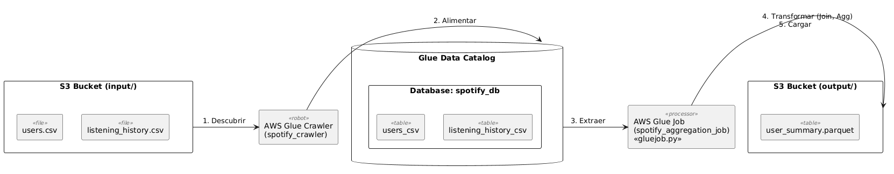

# Mini-Proyecto Taller AWS Glue: Análisis de Datos de Spotify

## Descripción del Caso

Simulamos tener datos de una plataforma de streaming tipo Spotify. Tenemos dos conjuntos de datos:
1.  **`users.csv`**: Información básica de los usuarios (ID, nombre de usuario, país).
2.  **`listening_history.csv`**: Historial de canciones escuchadas por usuario (ID de usuario, título de la canción, artista, duración en segundos).

## Objetivo del Taller

El objetivo de este taller es que los estudiantes de ingeniería de datos aprendan los conceptos básicos de AWS Glue realizando un proceso ETL (Extract, Transform, Load) sencillo pero completo:
*   Subir datos fuente a Amazon S3.
*   Utilizar un Crawler de AWS Glue para descubrir el esquema de los datos y registrarlos en el Glue Data Catalog.
*   Crear y configurar un Job de AWS Glue utilizando un script PySpark.
*   Implementar lógica de transformación de datos: unir dos fuentes de datos y realizar agregaciones (contar canciones, sumar tiempo de escucha).
*   Escribir el resultado procesado en formato Parquet de nuevo en S3.
*   Entender el flujo de trabajo básico de un pipeline de datos en AWS.

## Prerrequisitos

*   Una cuenta de AWS activa.
*   Acceso a la consola de AWS.
*   (Opcional pero recomendado) Conocimientos básicos de S3, Python y SQL.
*   (Opcional) AWS CLI configurada si se desea interactuar desde la terminal.

## Estructura del Proyecto